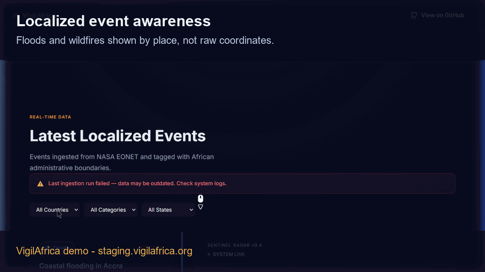

# VigilAfrica 🌍

**VigilAfrica** is an open-source effort to make natural event data more understandable and locally relevant across Africa.

The project translates raw geospatial event signals — floods, wildfires, storms, drought-related activity — into administrative areas people actually recognise: countries, states, provinces, and local government areas.

Instead of asking users to interpret coordinates and satellite metadata, VigilAfrica is being built to answer a simpler question:

**What is happening near me?**

---

## Demo



A fully isolated, seeded demo environment of VigilAfrica is available for evaluation:
> **Hosted Demo**: https://staging.vigilafrica.org

For instructions on running the demo locally, see the [Demo Environment Guide](DEMO.md).

---

## Why this project exists

Across Africa, environmental and natural event data is often available globally, but not always presented in ways that are easy for local communities, responders, researchers, journalists, or civic organisations to act on.

VigilAfrica bridges that gap by combining:

- global event feeds such as NASA EONET
- African administrative boundary context (Nigeria + Ghana, expanding)
- simple, location-aware user experiences

---

## Current status

> **Pre-launch operational prototype — v0.8 complete.** Real data, two countries, demo assets, and v1.0 deployment work in progress.

The system currently:

- **Ingests** floods and wildfire events from NASA EONET for Nigeria and Ghana on a configurable schedule
- **Enriches** every event with state/region names using PostGIS boundary matching
- **Serves** a paginated, filterable REST API (`/v1/events`) with `category`, `country`, `state`, and `status` filters
- **Displays** events on an interactive satellite map with location-aware "near you" context
- **Monitors** ingestion health with `/health`, failed-ingestion emails, and a staleness watchdog

Next milestone (v1.0): credible public launch — staging/production deployment, release tagging, and operational alerting validation.

---

## Local development

### Prerequisites

- Go 1.26+
- Node.js 22+
- Docker + Docker Compose (for PostgreSQL 15 + PostGIS 3)

### Setup

```bash
# Clone the repository
git clone https://github.com/didi-rare/vigilafrica.git
cd vigilafrica

# Copy environment variables
cp .env.example .env
# Edit .env — DATABASE_URL is required; Resend values enable email alerts

# Start PostgreSQL + PostGIS
docker compose up -d

# Install frontend dependencies
cd web && npm install && cd ..

# Start the Go API server (runs migrations automatically on startup)
npm run api:dev
# → http://localhost:8080

# Start the frontend dev server (separate terminal)
npm run web:dev
# → http://localhost:5173

# Verify the API is running
curl http://localhost:8080/health
```

### Run Go tests

```bash
cd api
go test ./...
```

---

## Architecture

VigilAfrica follows a **Poll → Enrich → Serve** pattern:

1. **Poll** — fetch raw events from NASA EONET (floods + wildfires, per-country bounding boxes)
2. **Enrich** — match event coordinates to state/region names using PostGIS boundary data
3. **Serve** — deliver localised event data via REST API → React frontend

```
NASA EONET → Go Scheduler → PostgreSQL + PostGIS → REST API → React (Vercel)
                                                        ↑
                                          MaxMind GeoLite2 (near-me context)
```

**Full architecture**: [`openspec/specs/vigilafrica/architecture.md`](openspec/specs/vigilafrica/architecture.md)

---

## Technology stack

| Layer            | Technology                       |
|------------------|----------------------------------|
| Backend          | Go 1.26                          |
| Frontend         | React 19 + Vite + TypeScript     |
| Database         | PostgreSQL 15 + PostGIS 3        |
| Maps             | MapLibre GL JS                   |
| Near-me context  | MaxMind GeoLite2 (local)         |
| Frontend hosting | Vercel                           |
| Backend hosting  | VPS (Docker + Caddy)             |
| Governance       | OpenSpec                         |

---

## Repository structure

```
/api              Go backend (API, ingestor, enrichment)
/web              React frontend (dashboard, map)
/openspec         Locked project specifications and ADRs
/docs             Coding standards (developers-go.md, developers-react.md)
.github/          CI/CD and OpenSpec drift detection workflows
docker-compose.yml  Local dev: PostgreSQL + PostGIS
```

---

## Roadmap

| Milestone | Theme                        | Status          |
|-----------|------------------------------|-----------------|
| v0.1      | Foundation                   | ✅ Complete      |
| v0.2      | First real data flow         | ✅ Complete      |
| v0.3      | Localization engine          | ✅ Complete      |
| v0.4      | Map + near-me experience     | ✅ Complete      |
| v0.5      | Operational prototype        | ✅ Complete      |
| v0.6      | Country expansion model      | ✅ Complete      |
| v0.7      | Second country stable        | ✅ Complete      |
| v0.8      | Pre-demo setup               | ✅ Complete      |
| v1.0      | Credible public launch       | Planned         |

Full roadmap with acceptance criteria: [`openspec/specs/vigilafrica/roadmap.md`](openspec/specs/vigilafrica/roadmap.md)

---

## Branch strategy

| Branch        | Environment | Purpose            |
|---------------|-------------|--------------------|
| `development` | Local/dev   | Active development |
| `main`        | Staging     | Auto-deployed staging |
| `release`     | Production  | Tagged, approval-gated production |

Deployment docs:

- [VPS deployment](docs/deployment/vps.md)
- [Release process](docs/deployment/release-process.md)
- [Resend setup](docs/deployment/resend-setup.md)

OpenSpec drift detection runs on every push to `development` and every PR to all branches.

---

## Contributing

See [CONTRIBUTING.md](CONTRIBUTING.md) for the development workflow, branch strategy, and coding standards.

Contributions, feedback, and collaboration ideas are welcome through **GitHub Issues**.

---

## License

VigilAfrica is licensed under the **Apache License 2.0** — open for collaboration while remaining friendly to public-interest, research, and commercial reuse.

---

Maintained by **[@didi-rare](https://github.com/didi-rare)**. For collaboration or project discussions, open a GitHub Issue.
