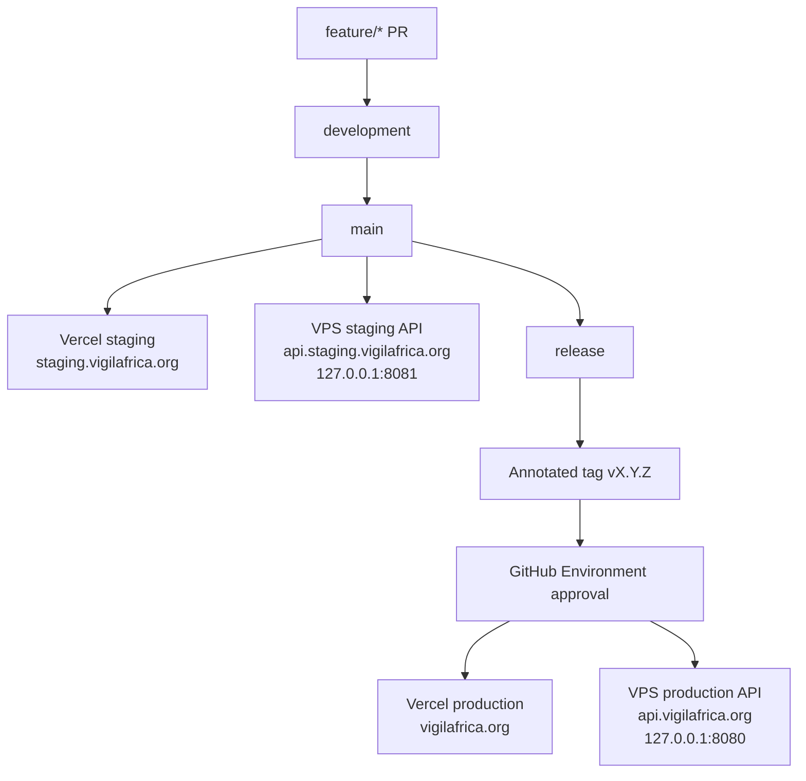

# Staging and Production Topology



## DNS

| Record | Type | Target |
|---|---|---|
| `api.vigilafrica.org` | A | VPS IPv4 |
| `api.staging.vigilafrica.org` | A | VPS IPv4 |
| `vigilafrica.org` | Vercel | production project |
| `staging.vigilafrica.org` | Vercel | staging project |

## Environment Matrix

| Variable | Staging | Production |
|---|---|---|
| `CORS_ORIGIN` | `https://staging.vigilafrica.org` | `https://vigilafrica.org` |
| `VITE_API_BASE_URL` | `https://api.staging.vigilafrica.org` | `https://api.vigilafrica.org` |
| `RESEND_API_KEY` | staging sending key | production sending key |
| `ALERTS_TO` | comma-separated maintainer inboxes in VPS `.env` | comma-separated maintainer inboxes in VPS `.env` |
| `APP_VERSION` | short commit SHA | SemVer tag |
| API host port | `127.0.0.1:8081` | `127.0.0.1:8080` |
| DB volume | `vigil-staging-data` | `vigil-prod-data` |

## Isolation Rules

- Staging and production never share database volumes.
- Runtime `.env` files live on the VPS and are not committed.
- Production deploys require GitHub Environment approval.
- Rollback redeploys a previous tag through the same production workflow.

## Operator Runbook

Operator commands for inspecting and probing a deployed environment. Replace `staging` with `production` for the prod stack. SSH access requires that your key is on the VPS and you are listed in the relevant GitHub Environment reviewers.

### SSH entry

```bash
ssh "$VPS_USER@$VPS_HOST"
```

### Tail all logs (live)

```bash
docker compose -f /opt/vigilafrica/staging/docker-compose.yml logs -f --tail=200
```

### Per-service logs

```bash
docker compose -f /opt/vigilafrica/staging/docker-compose.yml logs api   --tail=200
docker compose -f /opt/vigilafrica/staging/docker-compose.yml logs caddy --tail=200
docker compose -f /opt/vigilafrica/staging/docker-compose.yml logs db    --tail=200
```

### Container status

```bash
docker compose -f /opt/vigilafrica/staging/docker-compose.yml ps
```

### Health probe

From inside the VPS (bypasses Caddy and DNS):

```bash
curl -sS http://localhost:8081/health | jq    # staging
curl -sS http://localhost:8080/health | jq    # production
```

From outside (exercises DNS, TLS, Caddy):

```bash
curl -sS https://api.staging.vigilafrica.org/health | jq
curl -sS https://api.vigilafrica.org/health | jq
```

### Caddy reload

Caddy auto-reloads on config change inside the compose stack — see the existing `Caddyfile` deploy step in [release-process.md](./release-process.md). Do not restart Caddy manually unless that procedure fails.

### Rollback

See the rollback section of [release-process.md](./release-process.md). Rollback is always a redeploy of a previous annotated tag through the production workflow — never an in-place edit on the VPS.

## Namecheap DNS Checklist

Records required for the public hostnames. Record creation is operator action tracked under `chore-vps-v1-launch` — this checklist exists so the exact values are version-controlled.

| Host | Type | Value | TTL | Purpose |
|---|---|---|---|---|
| `staging` | CNAME | `cname.vercel-dns.com` | Automatic | Frontend — Vercel staging project |
| `api.staging` | A | `<VPS_IPv4>` | Automatic | Backend — VPS staging compose stack |
| `@` (apex) | ALIAS / A | `76.76.21.21` | Automatic | Frontend — Vercel production project |
| `api` | A | `<VPS_IPv4>` | Automatic | Backend — VPS production compose stack |

> The Vercel apex record value (`76.76.21.21`) is Vercel's published anycast IP. If Vercel issues a different value via the dashboard, prefer that.

### Verification

```bash
dig +short staging.vigilafrica.org
dig +short api.staging.vigilafrica.org
dig +short vigilafrica.org
dig +short api.vigilafrica.org

curl -sS https://api.staging.vigilafrica.org/health
curl -sS https://api.vigilafrica.org/health
```

A `DNS_PROBE_FINISHED_NXDOMAIN` in the browser, or empty `dig +short` output, indicates the corresponding record above has not yet been created or has not propagated.
