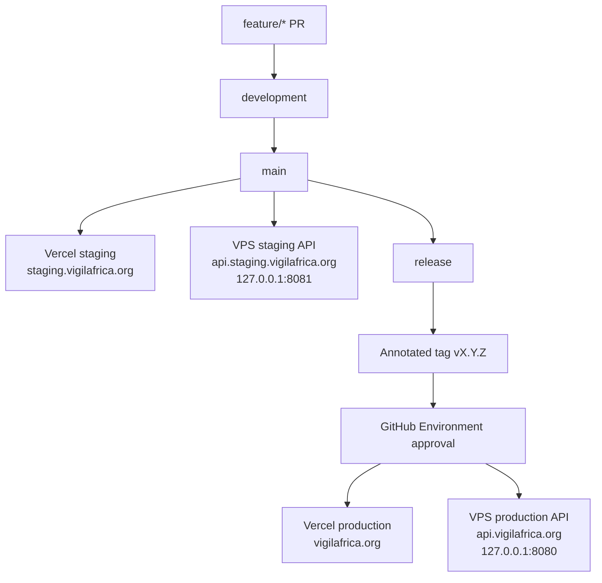

# Staging and Production Topology

## DNS

| Record | Type | Target |
|---|---|---|
| `api.vigilafrica.org` | A | VPS IPv4 |
| `api.staging.vigilafrica.org` | A | VPS IPv4 |
| `vigilafrica.org` | Vercel | production project |
| `staging.vigilafrica.org` | Vercel | staging project |

## Environment Matrix

| Variable | Staging | Production |
|---|---|---|
| `CORS_ORIGIN` | `https://staging.vigilafrica.org` | `https://vigilafrica.org` |
| `VITE_API_BASE_URL` | `https://api.staging.vigilafrica.org` | `https://api.vigilafrica.org` |
| `RESEND_API_KEY` | staging sending key | production sending key |
| `ALERT_EMAIL_TO` | maintainer inbox | maintainer inbox |
| `APP_VERSION` | short commit SHA | SemVer tag |
| API host port | `127.0.0.1:8081` | `127.0.0.1:8080` |
| DB volume | `vigil-staging-data` | `vigil-prod-data` |

## Isolation Rules

- Staging and production never share database volumes.
- Runtime `.env` files live on the VPS and are not committed.
- Production deploys require GitHub Environment approval.
- Rollback redeploys a previous tag through the same production workflow.
