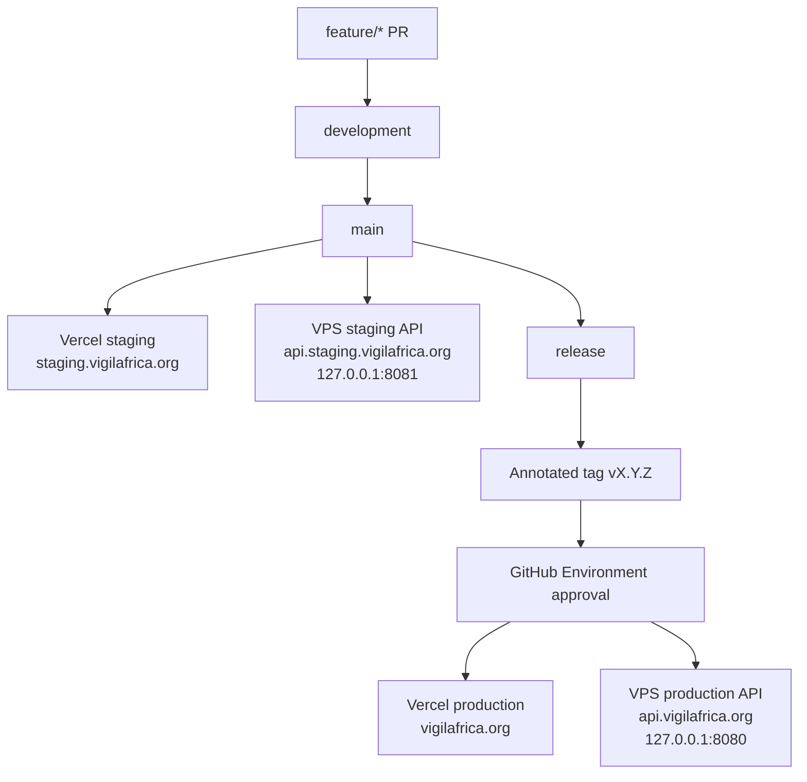

# Staging and Production Topology


```mermaid
flowchart TD
    Dev["feature/* PR"] --> Development["development"]
    Development --> Main["main"]
    Main --> StagingVercel["Vercel staging<br/>staging.vigilafrica.org"]
    Main --> StagingAPI["VPS staging API<br/>api.staging.vigilafrica.org<br/>127.0.0.1:8081"]
    Main --> Release["release"]
    Release --> Tag["Annotated tag vX.Y.Z"]
    Tag --> ProdGate["GitHub Environment approval"]
    ProdGate --> ProdVercel["Vercel production<br/>vigilafrica.org"]
    ProdGate --> ProdAPI["VPS production API<br/>api.vigilafrica.org<br/>127.0.0.1:8080"]
```

## DNS

| Record | Type | Target |
|---|---|---|
| `api.vigilafrica.org` | A | VPS IPv4 |
| `api.staging.vigilafrica.org` | A | VPS IPv4 |
| `vigilafrica.org` | Vercel | production project |
| `www.vigilafrica.org` | CNAME | Vercel domain target — added to the production project as a **308 redirect to the apex**, not a second alias. Verify with `curl -sSI https://www.vigilafrica.org` → `308` → `https://vigilafrica.org/` |
| `staging.vigilafrica.org` | Vercel | staging project |

DNS for `vigilafrica.org` is hosted at **Namecheap** (`dns1/dns2.registrar-servers.com`), not Vercel — records are edited under Namecheap → Advanced DNS. Add a hostname to the Vercel project *first*, then create the record Vercel asks for, so Vercel can issue the TLS certificate. A registrar-level "URL redirect" record is not a substitute: it serves HTTP only and leaves `https://` with a certificate error.

## Environment Matrix

| Variable | Staging | Production |
|---|---|---|
| `CORS_ORIGIN` | `https://staging.vigilafrica.org` | `https://vigilafrica.org` |
| `VITE_API_BASE_URL` | `https://api.staging.vigilafrica.org` | `https://api.vigilafrica.org` |
| `VITE_ENV` | `staging` (drives the staging banner + `noindex` robots tag) | `production` |
| `APP_ENV` | `staging` (hardcoded in `docker-compose.staging.yml`) | `production` (hardcoded in `docker-compose.prod.yml`) |
| `RESEND_API_KEY` | staging sending key | production sending key |
| `ALERTS_TO` | comma-separated maintainer inboxes in VPS `.env` | comma-separated maintainer inboxes in VPS `.env` |
| `APP_VERSION` | short commit SHA | SemVer tag |
| API host port | `127.0.0.1:8081` | `127.0.0.1:8080` |
| DB volume | `vigil-staging-data` | `vigil-prod-data` |

## Isolation Rules

- Staging and production never share database volumes.
- Runtime `.env` files live on the VPS and are not committed.
- Production deploys require GitHub Environment approval.
- Rollback redeploys a previous tag through the same production workflow.

## Vercel Project Settings

Both Vercel projects share `web/` as their root directory and consume the same [web/vercel.json](../../web/vercel.json). The branch each project deploys from is enforced via the Ignored Build Step, scripted at [web/scripts/vercel-ignore-build.sh](../../web/scripts/vercel-ignore-build.sh) and parameterised by the `DEPLOY_BRANCH` env var.

| Setting | `vigilafrica-staging` | `vigilafrica-production` |
| --- | --- | --- |
| Production Branch | `main` | `release` |
| Ignored Build Step (Settings → Build and Deployment) | `bash scripts/vercel-ignore-build.sh` | `bash scripts/vercel-ignore-build.sh` |
| `DEPLOY_BRANCH` env var (Settings → Environments → All Environments) | `main` | `release` |

Without the Ignored Build Step, Vercel auto-creates a preview deployment for every PR push regardless of base branch — so PRs targeting `development` would trigger preview builds on the production project. The script returns exit `0` (skip) for any ref that is not the project's `DEPLOY_BRANCH`, and exit `1` (build) for matching refs.

If a project is ever recreated, both the script reference and the env var must be re-applied — there is no `vercel.json` shortcut for this because both projects share the same file.

The same dashboard-only constraint applies to `VITE_ENV`: it must be set per project (staging project → `staging`, production project → `production`) via Settings → Environments → All Environments. **Do not** add `VITE_ENV` to `vercel.json` `build.env` — that would apply the same value to both projects and break the staging-only behaviour (the `noindex` robots tag and the staging banner). See [openspec/proposals/fix-staging-vite-env-flag.md](../../openspec/proposals/fix-staging-vite-env-flag.md).

## Operator Runbook

Operator commands for inspecting and probing a deployed environment. Replace `staging` with `production` for the prod stack.

⚠️ **GitHub Environment reviewers do not gate direct SSH.** They gate *workflow jobs and their
secrets* only. Direct access is decided on the host — by `authorized_keys`, `sshd_config`, account
state and the other authentication settings — with no involvement from GitHub. Today a single
`deploy` account reaches **both** environments (see `chore-vps-access-hardening` task 1.5).

### SSH entry

Verify the host key rather than accepting it on first use — the same value the deploy workflows pin
via `VPS_HOST_KEY` (see [vps.md](vps.md)).

`StrictHostKeyChecking=yes` **refuses** an unknown host rather than enrolling it, so the file has to
be written first — connecting with an empty known-hosts file just fails:

```bash
# 1. Write the line you verified at the provider console. Do this once.
install -m 700 -d ~/.ssh
printf '%s ssh-ed25519 AAAA...\n' "$VPS_HOST" > ~/.ssh/known_hosts_vigilafrica
chmod 600 ~/.ssh/known_hosts_vigilafrica

# 2. Then connect with strict checking against it. The extra options close the
#    other trust sources -- without them a configured KnownHostsCommand or a
#    DNS SSHFP record can still supply a key, so the file you just wrote would
#    not actually be the only thing trusted. Same set the deploy workflows use.
ssh -o StrictHostKeyChecking=yes \
    -o UserKnownHostsFile=~/.ssh/known_hosts_vigilafrica \
    -o GlobalKnownHostsFile=/dev/null \
    -o KnownHostsCommand=none \
    -o VerifyHostKeyDNS=no \
    -o CheckHostIP=no \
    -o UpdateHostKeys=no \
    "$VPS_USER@$VPS_HOST"
```

### Reading logs and container state

⚠️ **`sudo` is not optional here.** No human account is in the `docker` group — `vigil-admin` gets
`permission denied while trying to connect to the docker API` without it — and the per-environment
`.env` that Compose interpolates is `root:root 0600`. Every command in this section needs `sudo`.

⚠️ **Each environment has its own Compose file, and it is not `docker-compose.yml`.** That file is the
*development* stack and it exists in the checkout, so naming it does not fail — it quietly resolves to
services that are not what is deployed. `vigil-deploy-run` selects the file from the environment name:
staging deploys `docker-compose.staging.yml`, production `docker-compose.prod.yml`.

| | staging | production |
|---|---|---|
| Directory | `/opt/vigilafrica/staging` | `/opt/vigilafrica/production` |
| Compose file | `docker-compose.staging.yml` | `docker-compose.prod.yml` |
| Compose project | `staging` | `production` |
| Services | `staging-db`, `staging-api`, `staging-geoipupdate`, `staging-umami` | `prod-db`, `prod-api`, `prod-geoipupdate`, `prod-umami` |
| Containers | `vigilafrica-staging-{db,api,geoip,umami}` | `vigilafrica-prod-{db,api,geoip,umami}` |

There is **no `caddy` service and no `db` service** in either stack. Caddy runs on the host (see
[Caddy reload](#caddy-reload)); the database service is `staging-db` / `prod-db`.

⚠️ The GeoIP service and its container are **not** named the same: service `staging-geoipupdate`,
container `vigilafrica-staging-geoip`.

```bash
# Tail everything (staging shown; substitute the directory, file AND prefix for production)
cd /opt/vigilafrica/staging
sudo docker compose -f docker-compose.staging.yml logs -f --tail=200

# Per service
sudo docker compose -f docker-compose.staging.yml logs staging-api --tail=200
sudo docker compose -f docker-compose.staging.yml logs staging-db  --tail=200

# Container status
sudo docker compose -f docker-compose.staging.yml ps
```

Passing an absolute path instead of `cd`-ing is safe: Compose derives the project name from the
directory *containing the compose file*, not the working directory, so
`-f /opt/vigilafrica/staging/docker-compose.staging.yml` still resolves to project `staging`.

**Fastest path at 3am** — the containers have explicit `container_name` values, so this needs no
file, directory or project name to be correct:

```bash
sudo docker logs --tail=200 -f vigilafrica-prod-api
sudo docker ps --format '{{.Names}}	{{.Status}}'
```

### Health probe

From inside the VPS (bypasses Caddy and DNS):

```bash
curl -sS http://localhost:8081/health | jq    # staging
curl -sS http://localhost:8080/health | jq    # production
```

From outside (exercises DNS, TLS, Caddy):

```bash
curl -sS https://api.staging.vigilafrica.org/health | jq
curl -sS https://api.vigilafrica.org/health | jq
```

### Containers crash-looping on `server misbehaving` after a deploy

If the API or Umami restart in a loop with:

```text
hostname resolving error: lookup staging-db on 127.0.0.11:53: server misbehaving
```

the container has lost Docker's embedded DNS. This happens when the Compose **network** was removed
and recreated — for example because its subnet or other IPAM settings changed. Compose recreates only
the containers whose own definition changed and merely restarts the others, and a merely-restarted
container comes back unable to resolve its siblings by service name.

⚠️ **`up -d` does not repair it.** Force every container to be rebuilt against the new network:

```bash
cd /opt/vigilafrica/staging      # or /opt/vigilafrica/production
sudo docker compose -f docker-compose.staging.yml up -d --force-recreate
```

⚠️ **The database and the GeoIP updater will look healthy throughout**, because neither resolves
another service by name. Do not let that steer you toward a networking fault — check whether the
*failing* containers can resolve their peers. Observed on staging 2026-08-18.

### Caddy reload

⚠️ **Caddy is a host service, not a container.** It is not defined in any of the three Compose files.
`provision.sh` installs it from the Cloudsmith apt repository and runs it under systemd
(`systemctl enable --now caddy`), reading `/etc/caddy/Caddyfile`. Nothing about a deploy reloads it,
so a Compose command will never show it and never restart it.

Validate before reloading — a bad Caddyfile takes down every vhost at once, and `reload` keeps the
old config if validation fails:

```bash
sudo caddy validate --config /etc/caddy/Caddyfile
sudo systemctl reload caddy          # graceful; prefer over restart
sudo systemctl status caddy --no-pager
sudo journalctl -u caddy -n 100 --no-pager
```

The live `/etc/caddy/Caddyfile` is **not** generated from
[`deploy/Caddyfile.example`](../../deploy/Caddyfile.example) — the example is a starting point that is
installed by hand, so the two drift. As of 2026-08-18 the drift is cosmetic: the two `analytics.*`
blocks appear in the opposite order with trimmed comments, plus tab/space differences. **The
`api.vigilafrica.org` and `api.staging.vigilafrica.org` blocks are identical**, including the
`header_up X-Forwarded-For {remote_host}` line that makes the API's client-IP trust policy meaningful.
Diff them before assuming either is authoritative.

### Rollback

See the rollback section of [release-process.md](./release-process.md). Rollback is always a redeploy of a previous annotated tag through the production workflow — never an in-place edit on the VPS.

## Namecheap DNS Checklist

Records required for the public hostnames. Record creation is operator action tracked under `chore-vps-v1-launch` — this checklist exists so the exact values are version-controlled.

| Host | Type | Value | TTL | Purpose |
|---|---|---|---|---|
| `staging` | CNAME | `cname.vercel-dns.com` | Automatic | Frontend — Vercel staging project |
| `api.staging` | A | `<VPS_IPv4>` | Automatic | Backend — VPS staging compose stack |
| `@` (apex) | ALIAS / A | `76.76.21.21` | Automatic | Frontend — Vercel production project |
| `api` | A | `<VPS_IPv4>` | Automatic | Backend — VPS production compose stack |

> The Vercel apex record value (`76.76.21.21`) is Vercel's published anycast IP. If Vercel issues a different value via the dashboard, prefer that.

### Verification

```bash
dig +short staging.vigilafrica.org
dig +short api.staging.vigilafrica.org
dig +short vigilafrica.org
dig +short api.vigilafrica.org

curl -sS https://api.staging.vigilafrica.org/health
curl -sS https://api.vigilafrica.org/health
```

A `DNS_PROBE_FINISHED_NXDOMAIN` in the browser, or empty `dig +short` output, indicates the corresponding record above has not yet been created or has not propagated.
