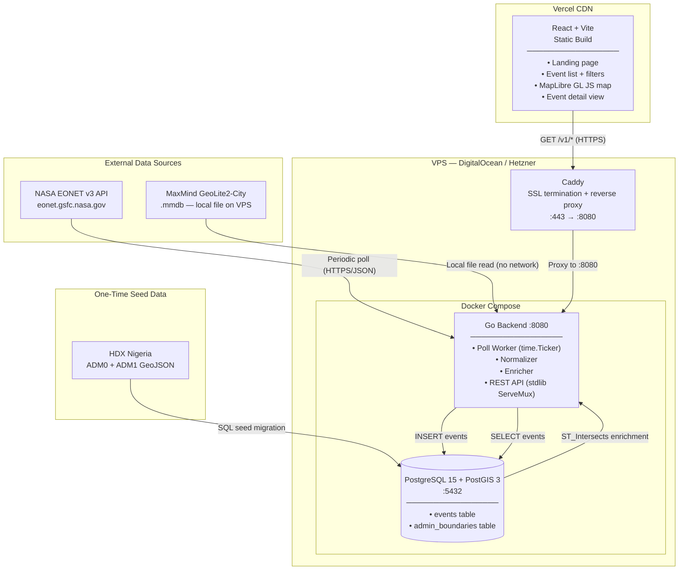
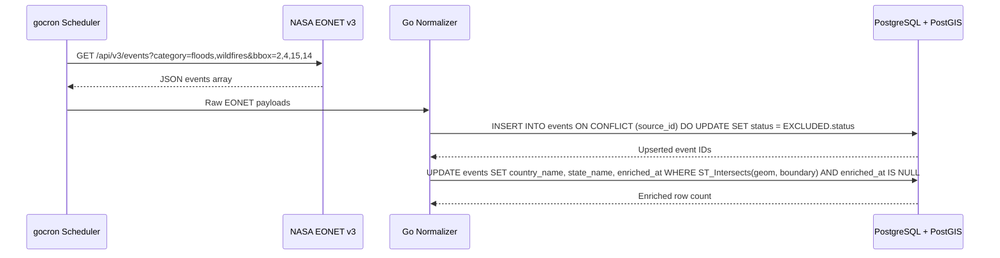
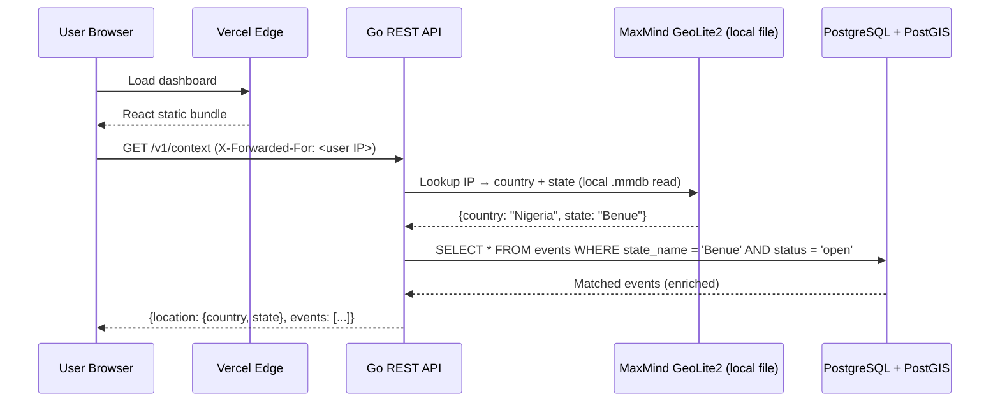

# VigilAfrica — Architecture Specification

**Version**: 1.0
**Status**: LOCKED — Approved 2026-04-12
**Maintained by**: @didi-rare

> **Governance rule**: Technology choices in this document are locked by ADRs in `decisions.md`. Any deviation from the confirmed stack requires a new ADR. No implementation may introduce technologies not listed here.

---

## 1. Architecture Pattern

VigilAfrica follows a **Poll → Enrich → Serve** architecture:

1. **Poll** — Go backend periodically fetches raw events from NASA EONET v3 (Floods + Wildfires, Nigeria bounding box)
2. **Enrich** — Events are normalized into the internal model and spatially matched to Nigerian administrative boundaries via PostGIS
3. **Serve** — Enriched events are served via a REST API consumed by the React frontend

---

## 2. Confirmed Technology Stack

| Layer                | Technology                          | ADR         | Status      |
|----------------------|-------------------------------------|-------------|-------------|
| Backend language     | Go 1.26                             | ADR-008     | Locked      |
| Frontend framework   | React 19 + Vite + TypeScript        | —           | Locked      |
| Database             | PostgreSQL 15 + PostGIS 3           | —           | Locked      |
| Map library          | **MapLibre GL JS v3+**              | ADR-001     | Locked      |
| IP geolocation       | MaxMind GeoLite2-City (local .mmdb) | —           | Locked      |
| Frontend hosting     | **Vercel**                          | ADR-002     | Locked      |
| Backend + DB hosting | **Single VPS, two isolated stacks** | ADR-003, ADR-014 | Locked      |
| Container runtime    | Docker Compose                      | ADR-003     | Locked      |
| Reverse proxy        | Caddy                               | ADR-003     | Locked      |
| PostgreSQL driver    | `jackc/pgx` (no ORM)               | ADR-009     | Locked      |
| API protocol         | REST / JSON                         | —           | Locked      |
| Go scheduler         | stdlib `time.Ticker`               | ADR-011     | Locked      |
| GeoIP Go library     | `oschwald/geoip2-golang`           | —           | Locked      |

---

## 3. System Architecture



---

## 4. Deployment Topology

```
[Vercel staging]    staging.vigilafrica.org  ─┐
                                               ├─► [Caddy on VPS :443]
[Vercel production] vigilafrica.org          ─┘       │
                                                       ├─ api.staging.vigilafrica.org -> 127.0.0.1:8081
                                                       └─ api.vigilafrica.org         -> 127.0.0.1:8080

[/opt/vigilafrica/staging]
  docker-compose.staging.yml
  Go API + PostGIS + GeoIP updater
  volumes: vigil-staging-data, staging-maxmind-data

[/opt/vigilafrica/production]
  docker-compose.prod.yml
  Go API + PostGIS + GeoIP updater
  volumes: vigil-prod-data, prod-maxmind-data
```

### Environment Separation

| Git Branch    | Environment | Target                    |
|---------------|-------------|---------------------------|
| `development` | Local dev   | Docker Compose (localhost) |
| `main`        | Staging     | VPS staging stack + Vercel staging |
| `release`     | Production  | SemVer-tagged VPS production stack + Vercel production |

---

## 5. Data Flow: Ingestion



---

## 6. Data Flow: Context (Near You)



If IP resolution fails at any step, the API returns `{"location": null, "events": []}` with HTTP 200. It never returns an error for location failure.

---

## 7. Repository Structure

```
vigilafrica/
├── api/                             # Go backend
│   ├── cmd/
│   │   └── server/
│   │       └── main.go              # Entry point — wires all internal packages
│   ├── internal/
│   │   ├── alert/                   # Resend email delivery + staleness watchdog
│   │   ├── ingestor/                # EONET fetch + poll worker
│   │   ├── normalizer/              # Raw payload → internal Event model
│   │   ├── enricher/                # PostGIS spatial enrichment
│   │   ├── geoip/                   # MaxMind GeoLite2 wrapper
│   │   └── api/                     # HTTP handlers, router (chi), middleware
│   ├── db/
│   │   ├── migrations/              # 001_create_events.sql, 002_create_admin_boundaries.sql ...
│   │   └── seeds/                   # sample_events_nigeria.sql (local dev only)
│   └── go.mod
│
├── web/                             # React + Vite + TypeScript frontend
│   ├── src/
│   │   ├── components/              # Reusable UI components
│   │   ├── pages/                   # Route-level pages (Home, Events, EventDetail)
│   │   └── main.tsx                 # Vite entry point
│   └── package.json
│
├── openspec/                        # Governance specification layer
│   └── specs/vigilafrica/
│       ├── product.md               # Feature registry + acceptance criteria (LOCKED)
│       ├── roadmap.md               # Milestone plan v0.1–v1.0 (LOCKED)
│       ├── architecture.md          # This file (LOCKED)
│       ├── api-contract.md          # API endpoint contracts (LOCKED)
│       ├── data-model.md            # Database schema + Go structs (LOCKED)
│       └── decisions.md             # Architecture Decision Records (LOCKED)
│
├── .github/
│   └── workflows/
│       ├── ci-cd.yml                # Build, test, deploy
│       ├── openspec-verify.yml      # Spec drift detection
│       └── community.yml            # First-interaction welcome
│
├── docker-compose.yml               # Local dev: PostgreSQL + PostGIS
├── docker-compose.staging.yml       # VPS staging stack
├── docker-compose.prod.yml          # VPS production stack
├── deploy/                          # Caddy example + VPS provisioning script
├── openspec.yaml                    # OpenSpec project configuration
├── package.json                     # Root scripts (api:dev, web:dev, spec:validate)
├── .env.example                     # All required environment variables
├── LICENSE                          # Apache 2.0
└── README.md                        # Project-stage README (prototype)
```

> **Note**: There is no `/infra` directory. Deployment configuration lives in the root Docker Compose files and `deploy/`. Runtime `.env` files remain on the VPS only. See ADR-003 and ADR-014.

---

## 8. API Design Principles

- All API routes prefixed `/v1/`
- JSON-only responses: `Content-Type: application/json`
- All errors: `{"error": "<human-readable message>"}` — never expose stack traces
- Pagination via `?limit=<n>&offset=<n>` query params (default 50, max 200)
- CORS configured for the Vercel production domain via `CORS_ORIGIN` environment variable
- No authentication in MVP

See `api-contract.md` for full endpoint definitions.

---

## 9. Security Baseline (MVP)

| Area           | Approach                                                                |
|----------------|-------------------------------------------------------------------------|
| TLS            | Caddy auto-provisioned Let's Encrypt certificate                        |
| CORS           | Allowlist set to Vercel domain only (`CORS_ORIGIN` env var)            |
| IP trust       | Trust `X-Forwarded-For` from Vercel only (not arbitrary proxies)       |
| Secrets        | All secrets via environment variables — never committed to the repo     |
| MaxMind .mmdb  | Not committed to repo (`.gitignore` pattern: `*.mmdb`)                 |
| SQL injection  | `pgx` parameterised queries (`$1`, `$2`) — no string interpolation     |
| Auth           | None in MVP — public read-only API                                      |
